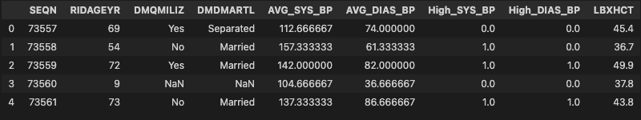
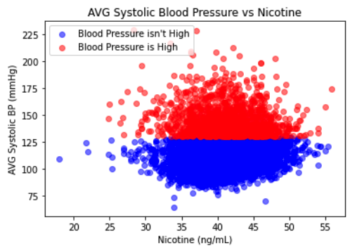
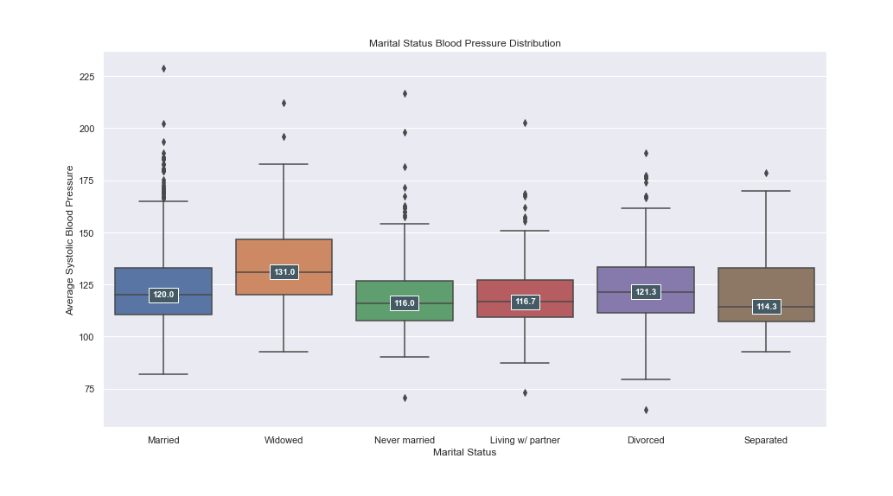
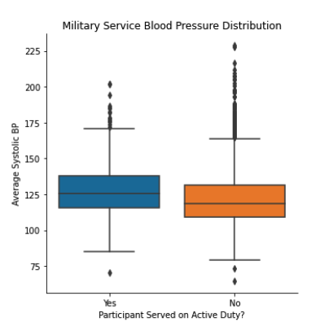
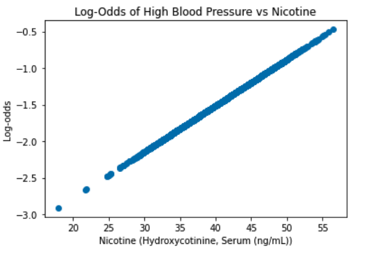
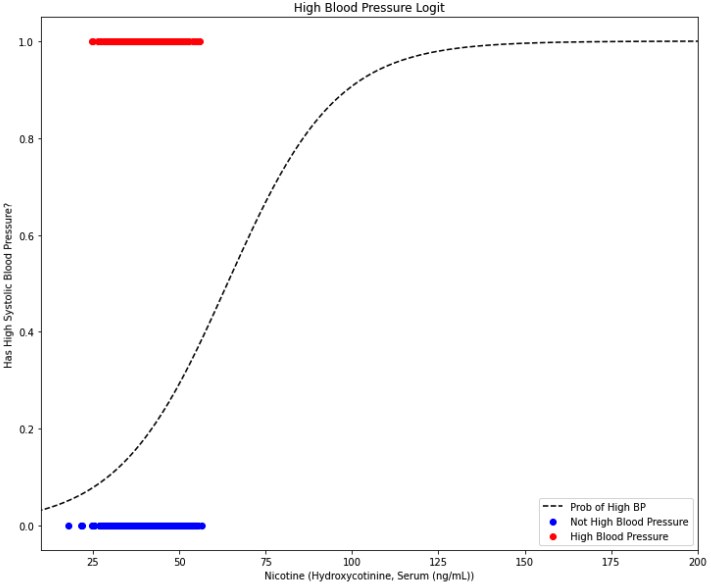
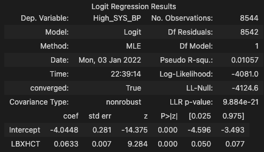

# Health Factors & High Blood Pressure

## <strong> Background & Motivation </strong>
Being an Army Officer, physical readiness is paramount; you have to keep your body in good shape to meet the requirements of the profession. Exercise plays a key role in maintaining physical fitness, but the things you consume are equally important. Nicotine use is widespread among officers, non-commissioned officers and soldiers alike and I am concerned about what negative impacts this might have on health. Because of this, I wanted to examine the effects of nicotine use on blood pressure.

## <strong> Questions </strong>

* How does nicotine affect the likelihood that someone has high blood pressure?
* What other health factors have an effect on this likelihood?

## <strong> Data </strong>
The data I used for this project comes from the <a href="https://www.kaggle.com/cdc/national-health-and-nutrition-examination-survey">2013-2014 National Health and Nutrition Examination Survey (NHANES)</a>, an annual survey conducted by the CDC. The survey contains information about participants from 15 different counties across the United States. The data combines medical questionnaire answers as well as medical examinations and labs. The data was broken up into 6 files:

* "demographic": 47 columns, 10176 rows
* "diet": 168 columns, 9814 rows
* "examination": 224 columns, 9814 rows
* "labs": 424 columns, 9814 rows
* "medications": 13 columns, 20195 rows
* "questionnaire": 953 columns, 10176 rows

Obviously, I couldn't include every column in my analysis, so I decided to focus on participants' ages, blood pressure, marital status, and the amount of nicotine found during their labs. This resulted in the data below:

### <u>Summary of the Data:</u>
10175 Rows, each containing the following information for unique patients:
<ul>
	<li>SEQN: the Participant's Unique Sequence Number</li>
	<li>RIDAGEYR: Age</li>
	<li>DMQMILIZ: Did the participant serve active duty in US Armed Forces?</li>
	<li>DMDMARTL: Marital Status</li>
	<li>AVG_SYS_BP: Average Systolic Blood Pressure</li>
	<li>AVG_DIAS_BP: Average Diastolic Blood Pressure</li>
	<li>High_SYS_BP: Does the participant have a High Average Systolic Blood Pressure (>= 130 mmHg)</li>
	<li>High_DIAS_BP: Does the participant have a High Average Diastolic Blood Pressure (>= 80 mmHg)</li>
	<li>LBXHCT: Nicotine Metabolate Levels Detected (Hydroxycotinine, Serum (ng/mL))</li>

</ul>

### <u>Cleaning:</u>
<ul>
	<li>I first selected the columns that I wanted to focus on and removed the rest.</li>
	<li>Initially, all categorical column entries were recorded as integers representing participant responses. I found a website that had a legend that explained each number, then I replaced all the numbers with more readable text.</li>
	<li>I created the AVG_SYS_BP and AVG_DIAS_BP columns by taking the average of the four blood pressure readings for each patient.</li>
	<li>I then created the High_SYS_BP and High_DIAS_BP columns by comparing each average blood pressure with the threshold for high blood pressure (Systolic >= 130 mmHg; Diastolic >= 80 mmHg). I had to convert these columns to integers because the Logistic Regression function couldn't interpret Boolean values.</li>
	<li>I created a CleanDF class that creates a cleaned dataframe containing all of the features listed above.</li>
	<li>NaN values are ignored by both the plotting libraries and the libraries I used to create my logistic regression model, so I did not remove them.</li>
</ul>

# Part 1: Visualization

I first made a scatterplot of Average Systolic Blood Pressure vs Nicotine to quickly visualize my data.

The relationship between Blood Pressure and Nicotine does not appear to be linear, so a linear regression would not be appropriate for modeling this relationship.

I also wanted to see how blood pressure varied between different demographics of people. Below are Box and Whisker plots showing the distribution of blood pressure readings for people of different marital statuses:

...and another comparing blood pressure readings of people who served in the active duty military and those that didn't:

It is interesting to note that widowers seem to have a higher mean blood pressure than people of other marital statuses, while people living with a partner seem to have the lowest mean blood pressure. People who have served in the also seem to have higher mean blood pressure than people who haven't.

# Part 2: Creating a Model

As previously noted, the relationship between Blood Pressure and Nicotine cannot be represented linearly, so it would be more appropriate to view this as a binary classification problem: "What are the odds that a participant has high blood pressure, based on the amount of nicotine detected during their labs? I chose to create an inferential logistic regression!

## <u>Assumptions of Inferential Logistic Regression:</u>

In order to perform an inferential logistic regression, my problem had to meet the following requirements:

  
  * <u>Correct Distribution of Outcome:</u> a binary regression requires the dependent variable to be binary
    * In my regression dependent variable is binary: a person either has high blood pressure (1) or doesn't (0) :white_check_mark:
  * <u>Independence:</u> observations should be independent
    * All entries in my data are for unique people. :white_check_mark:
  * <u>No Multicollinearity:</u> logistic regression requires there to be little to no multicollinearity among the independent variables
    * There is only one independent variable in my model: nicotine. :white_check_mark:
  * <u>Linearity of the Log Odds:</u> independent variables must be linearly related to the log odds
    * 
	* The log odds are linear :white_check_mark: 
  * <u>Sample Size:</u> at minimum, 10 cases with the least frequent outcome for each independent variable in your model
    * (10 x 1 independent variable)/(0.30 probability of a person having high blood pressure) = 33 minimum samples; there are 5210 non-NaN samples. :white_check_mark:

My model meets all of these assumptions, so I was able to proceed with my regression. To accomplish this, I created a new column in my data containing a "1" if the participant had high systolic blood pressure on average and a "0" if they did not I then created my logistic regression model.

* 

# Part 3: Evaluating the Model

To see if nicotine had an effect on the odds of someone having high blood pressure, I looked at the summary for my model:

* 

The p-value for nicotine is 0.000, meaning that nicotine metabolates have a statistically significant effect on the odds of someone having high blood pressure. Because the coefficient associated with nicotine is positive, the more nicotine someone has in their system, their chances of having high blood pressure increases.

Though this is the case, the pseudo R-squared value for this model is 0.01057, meaning that nicotine alone cannot accurately determine the likelihood of high blood pressure.

# Conclusions

## <u>Future Research:</u>

# Works Cited